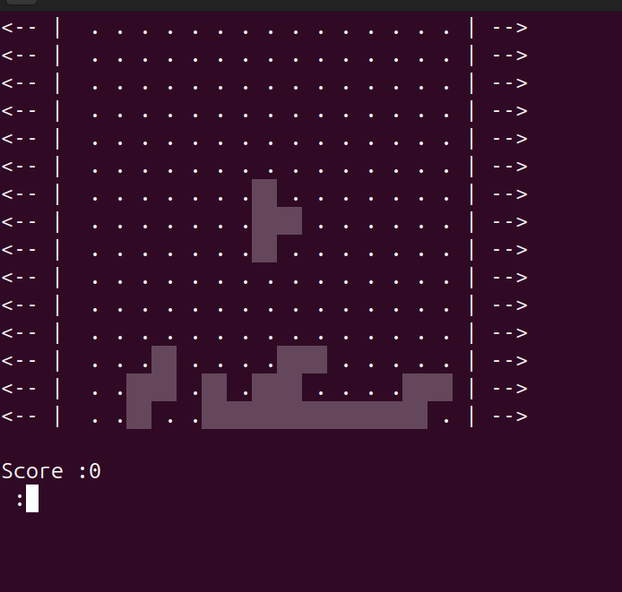
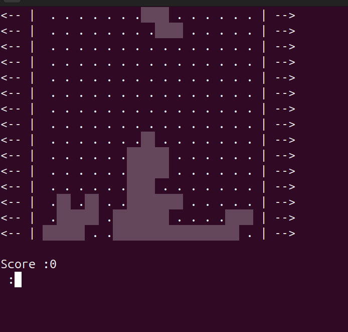
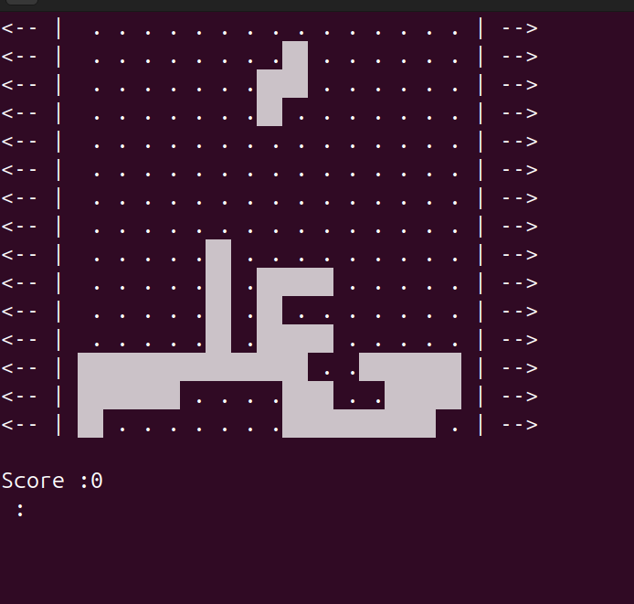

# Tetris in C

A simple Tetris game built from scratch in C, inspired by the movie *Tetris (2023)*.

## 🚀 About the Project
I was fascinated by how a regular government employee in the Soviet Union created the legendary Tetris in 1984 using Pascal. That story inspired me to take on the challenge of building my own version using C. After days of sketching and iterating, I finally built Tetris from scratch.

## 🎮 Features
- Classic Tetris gameplay
- Randomly generated tetrominoes
- Smooth movement and rotation
- Score tracking
- Simple yet engaging 

## 🎥 ScreenShots

## 📌 To-Do / Future Improvements
- Add different difficulty levels
- Improve UI with better graphics

## 🤝 Contributing
Feel free to fork this project and contribute! Open an issue or submit a pull request if you have suggestions.

## 💡 Inspiration
This project was motivated by the *Tetris (2023)* movie and the incredible story of Alexey Pajitnov. 

  <b>~Sic Parvis Magna~</b>

